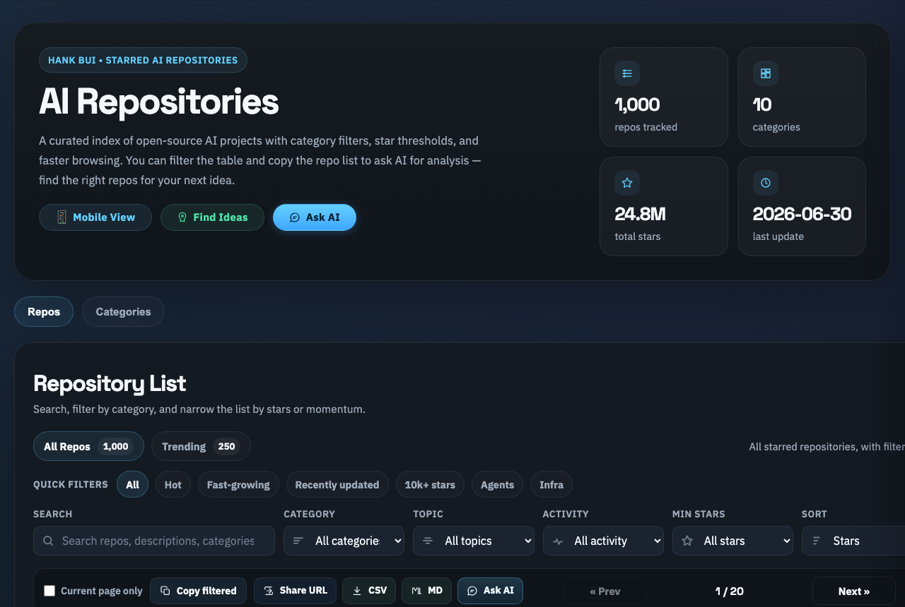
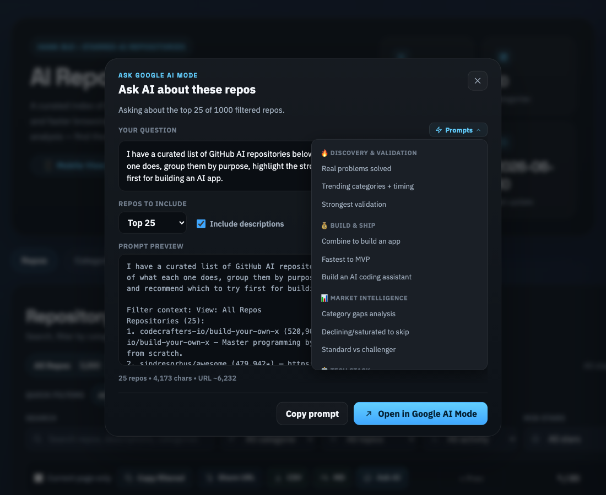
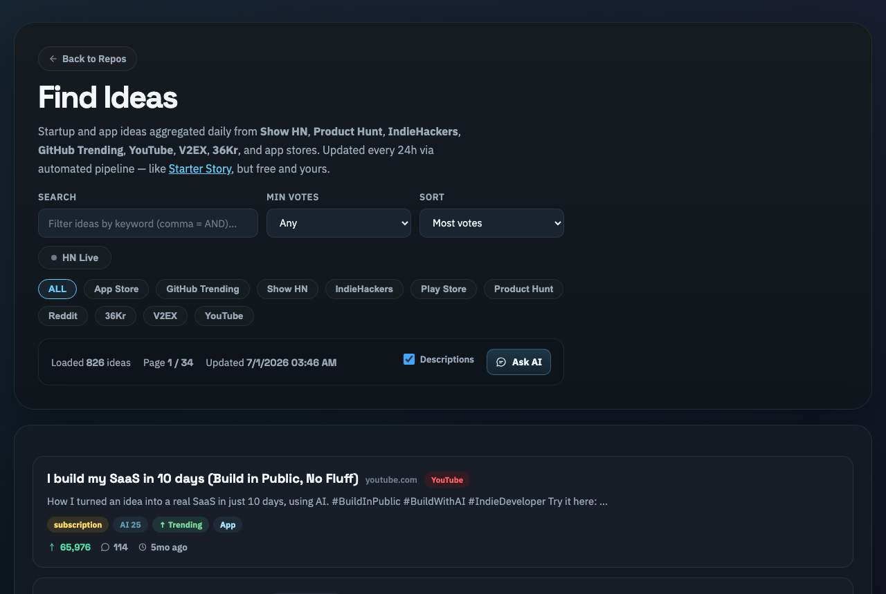

# ⭐ AI Repositories

### A curated, auto-updated directory of the best open-source AI &amp; LLM projects on GitHub — with powerful filtering, trend tracking, and one-click "Ask AI" analysis.

  
  
  
  

<h3>
  <a href="https://hankbui.github.io/my-starred-AI-repos-site/">→ Browse the directory live</a>
</h3>

---

## ✨ What is this?

**AI Repositories** is a fast, dark-themed web directory that indexes **1,000+ open-source AI/LLM repositories** and keeps them fresh **automatically, every day**. Instead of losing great projects in an endless list of GitHub stars, you get a clean, searchable, sortable catalogue with growth signals and built-in AI analysis — so you can find the right tool for your next idea in seconds.

> No sign-up. No tracking. Just a fast static site.

---

## 🚀 Features

### 📚 A directory built for discovery
- **1,000+ AI/LLM repos**, organised into **10 categories** (Agents, Models &amp; Inference, Developer Tools, Vision &amp; Media, Infrastructure, and more).
- **Powerful filtering** — full-text search, category, topic, activity, minimum stars, and 8 sort modes.
- **One-tap quick filters** — `Hot` · `Fast-growing` · `Recently updated` · `10k+ stars` · `Agents` · `Infra`.
- **Repo detail drawer** — stars, forks, growth, license, homepage, and a cached README preview.

### 📈 Trend tracking
- A dedicated **Trending** view ranks repos by momentum, not just raw stars.
- **1-day &amp; 7-day star growth** columns and a blended **trend score** highlight what's heating up *right now*.

### 🤖 Ask AI — analyse repos in one click
- Filter the list, hit **Ask AI**, and the current selection is packaged into a ready-to-send prompt for **Google AI Mode**.
- **12 built-in prompt templates** across 4 categories (Discovery, Build &amp; Ship, Market Intelligence, Tech Stack) — plus your own **custom prompts**, saved locally.

  

### 💡 Find Ideas — bonus startup-idea radar
- A companion page that aggregates **startup &amp; app ideas** from **Show HN, Product Hunt, IndieHackers, Reddit, App Store, Play Store, GitHub Trending, V2EX, 36Kr &amp; YouTube**.
- Each idea is enriched with **revenue signals, business model, AI-potential score, and trend direction** — filterable by source, score, and keyword.

  

### 🛠️ Built-in exports
- **Copy filtered**, **CSV**, **Markdown**, and a shareable **URL** that preserves your exact filters.

### 📱 Polished everywhere
- Responsive **desktop &amp; mobile** layouts, smooth dark UI, and a lightweight static build that loads instantly.

---

## 🔄 How it stays fresh

The directory is regenerated **automatically every day** by a GitHub Actions pipeline that pulls the latest stats and ideas, then publishes this static site to GitHub Pages. Open the site any day and the data is current — no manual updates needed.

---

## 🧱 Built with

`Vanilla JS` · `HTML` · `CSS` — zero frameworks, zero build step. Data served as static JSON. Hosted on **GitHub Pages**.

---

### ⭐ Find this useful?

If this directory helps you discover a great project, **a star is hugely appreciated** — it helps others find it too.

Built with ❤️ by <a href="https://github.com/hankbui">@hankbui</a> · Auto-updated daily

